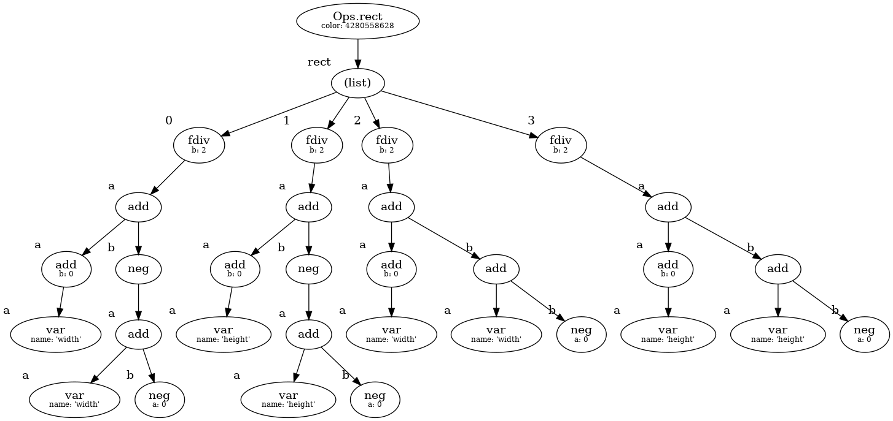
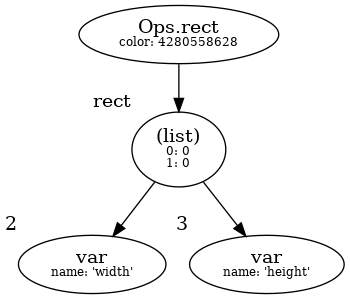

# SimplExp

Fast and crude mathematical expression simplifier for Python and Rust

Used in [BoldUI](https://github.com/Wazzaps/boldui).

## Example

```python
from simplexp import var, Expr

# Simplification:
expr = ((var('x') + var('x')) / 2 + 10).simplify()
print(expr)  # => (x + 10)

# Serialization:
print(Expr.to_dict(expr))  # => {'type': 'add', 'a': {'type': 'var', 'name': 'x'}, 'b': 10}

# Values are kept as values (when optimized successfully):
print(Expr.to_dict(Expr(100) + Expr(200)))  # => 300
```

## How it looks visually

Optimizing a "rect" operation in BoldUI, which holds a list of 4 expressions. Each is optimized using SimplExp:

### Before optimization



### After optimization


